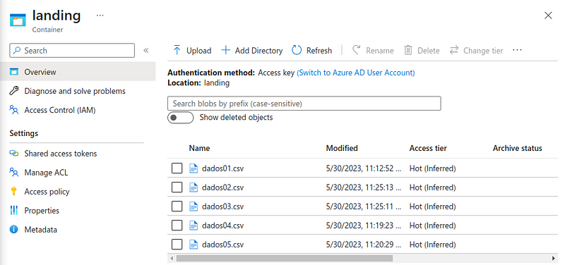

# Data Pipeline ETL (Azure/Terraform e Databricks)
## Toda a descrição (passo a passo) deste projeto está disponibilizado neste post: https://medium.com/@danilojpfreitas/constru%C3%A7%C3%A3o-de-uma-data-pipeline-etl-azure-terraform-e-databricks-a0655d03f6a8
---

Neste projeto foi construído um Data Pipeline com a utilização de algumas ferramentas incríveis: Terraform, Azure Data Factory, Databricks e Azure Data Lake Gen 2.
O principal objetivo deste projeto é por em prática essas ferramentas para a extração, transformação e carregamento (ETL) de uma base disponibilizado pelo governo federal da vacinação da COVID 19 (https://opendatasus.saude.gov.br/dataset/covid-19-vacinacao).

## :bulb: Data Pipeline

## :memo: Dados Antes e Após a Transformação/Modelagem:

Os dados disponibilizados pelo governo estão em formato CSV e são divididos por estado. Para esta análise foram utilizados os dados do estado de Alagoas que estão estruturados na seguinte maneira:

## :scroll: Visão geral da arquitetura

Partindo como base o consumo da base de dados pública da vacinação da COVID 19 (https://opendatasus.saude.gov.br/dataset/covid-19-vacinacao). A ingestão dos dados foi realizada pelo Azure Data Factory em formato CSV e carregados na camada Landing do diretório da Azure Blob Storage (Data Lake Gen 2).

Todo o CSV depositado na camada Landing foi tratado e carregado para as outras camadas (Processing e Curated) no Azure Databricks. No notebook do Databricks é definido primeiramente a montagem do Data Lake (necessário realizar alguns processo de permissões).

Os dados CSV da camada Landing foram transformados para o formato parquet e carregados na camada Processing e em seguida foram criadas algumas tabelas específicas para análise na Curated zone (consumidas diretamente pelo Power BI).

## :file_folder: Terraform

Todas as features da Azure foram provisionando utilizando infraestrutura como código com o Terraform. Todos os passos para sua execução estão bem descritos no meu Post no Medium ().

## :fast_forward: Ingestão dos dados

O processo de ingestão dos dados foi executado com Azure Data Factory da base de do governo ao Data Lake (Azure Data Lake Gen2).

## :rocket: Modelagem dos Dados pelo Azure Databricks

Nesta etapa foi efetuado por meio do Databricks a transformação dos dados CSVs para outras camadas (Processing e Curated). Para isso foi criado um notebook disponível neste diretório.

Basicamente, todo o conteúdo foi transformado para o formato Parquet e carregado na Processing Zone. Posteriormente, foram criadas algumas tabelas específicas para utilização no Power BI => VacinaçãoGeral e Vacinação em Maceió 2021, 2022 e 2023.

## :eye: Visualização dos Dados pelo Power BI

A última etapa deste projeto é a chegada de nossos dados no Power BI. Para isso foi utilizado a opção de carregamento de dados do Azure Databricks do Power BI.

Com a obtenção das tabelas geradas na Curated Zone foi possível desenvolver um simples Dashboard com algumas métricas da vacinação da Covid 19 em Alagoas.

---
